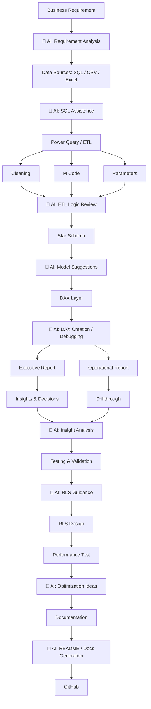

# AI-Augmented Development Process

This project was built using AI tooling to accelerate execution — requirement framing, SQL/DAX drafting, debugging, and documentation — while all design decisions (schema design, DAX logic validation, business interpretation of insights) were owned and validated independently.

| Stage | AI Assistance | Your Contribution |
|---|---|---|
| Requirement Analysis | Helped frame churn KPIs from business goals | Chose which KPIs mattered for telecom churn specifically |
| ETL | Suggested TotalCharges cleaning approach | Validated against actual data quirk (11 blank rows) |
| DAX Layer | Drafted Churn Risk Score formula structure | Tuned weights (40/25/20/15) based on domain logic |
| RLS | Explained USERPRINCIPALNAME() pattern | Designed the manager-territory mapping |
| Documentation | Drafted README structure | Wrote all business insights and final narrative |